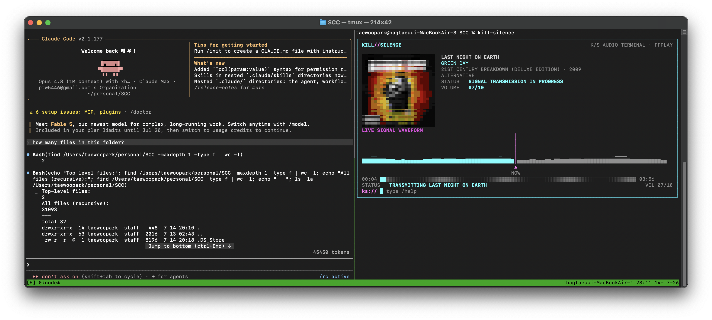
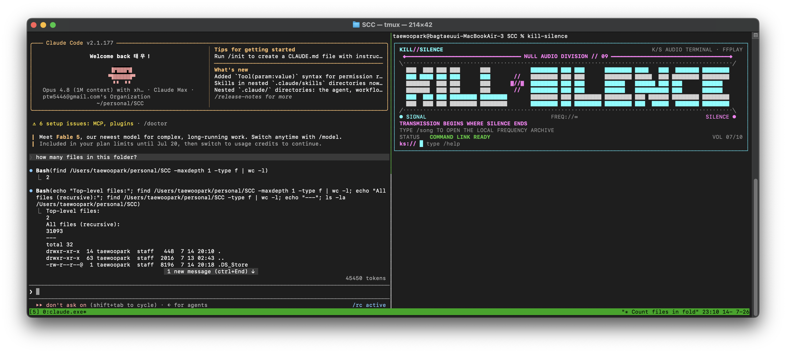
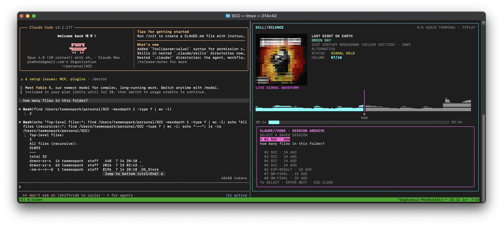
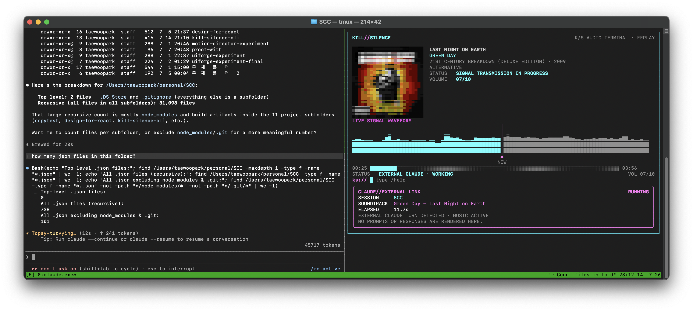
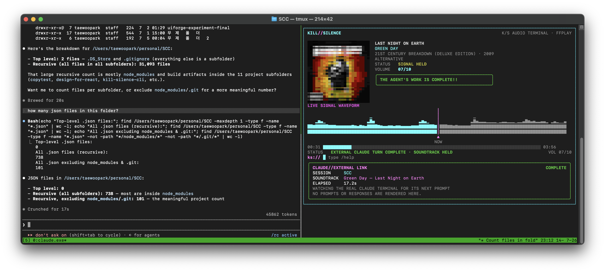

<pre align="center">
██╗  ██╗ ██╗ ██╗     ██╗          ██╗ ██╗     ███████╗ ██╗ ██╗     ███████╗ ███╗   ██╗  ██████╗ ███████╗
██║ ██╔╝ ██║ ██║     ██║         ██╔╝██╔╝     ██╔════╝ ██║ ██║     ██╔════╝ ████╗  ██║ ██╔════╝ ██╔════╝
█████╔╝  ██║ ██║     ██║        ██╔╝██╔╝      ███████╗ ██║ ██║     █████╗   ██╔██╗ ██║ ██║      █████╗
██╔═██╗  ██║ ██║     ██║       ██╔╝██╔╝       ╚════██║ ██║ ██║     ██╔══╝   ██║╚██╗██║ ██║      ██╔══╝
██║  ██╗ ██║ ███████╗███████╗ ██╔╝██╔╝        ███████║ ██║ ███████╗███████╗ ██║ ╚████║ ╚██████╗ ███████╗
╚═╝  ╚═╝ ╚═╝ ╚══════╝╚══════╝ ╚═╝ ╚═╝         ╚══════╝ ╚═╝ ╚══════╝╚══════╝ ╚═╝  ╚═══╝  ╚═════╝ ╚══════╝
</pre>

<p align="center"><strong>A tiny Spotify terminal for long coding-agent nights.</strong></p>
<p align="center"><em>Let the agent cook. Let the terminal sing. ♪</em></p>

<p align="center">
  
  
  
  
</p>

KILL//SILENCE is a cyan-and-magenta Spotify control surface for the quiet gaps between coding-agent turns. It keeps the playful terminal from the original local demo—colour album art, a dense vertical signal preset, slash commands, responsive agent panels—and replaces the local-file player with Spotify's library, search, queue, and Connect playback.

Its small trick is `/with-agents`: choose a real external Claude Code session, then keep working in that terminal as usual. When a turn starts, the soundtrack resumes. When Claude finishes, Spotify pauses and **THE AGENT'S WORK IS COMPLETE!!** blinks ten times, then stays lit in the panel.

No embedded prompt box. No copied responses. No new AI workspace. Just a cheerful audio sidecar for the terminal you already use.

<p align="center">
  
</p>

## What survived the rebuild

- Full-colour half-block album cover art with an ANSI-256 fallback for Terminal.app
- A fixed, dense vertical waveform preset that scrolls with playback—decorative on purpose, not fake analysis
- Indexed slash-command suggestions with arrow-key selection and Tab completion
- `/home` and `/player` switch views without touching the active Spotify playback
- `/song`, Spotify search, queue, like, playback, volume, and Connect-device commands
- `/with-agents` read-only Claude Code session discovery and lifecycle tracking
- Wide terminals place the agent panel on the right; narrow terminals place it below
- Claude turn start resumes music; completion or interruption pauses it
- Spotify advances normally through the selected playlist or track list
- The original retro-futuristic boot screen and blinking completion signal

## Install

You need Rust, a Spotify Premium account, and an active Spotify Desktop/Connect device.

```bash
git clone https://github.com/TaewoooPark/kill-silence.git
cd kill-silence
cargo install --path spotify_player --locked --force

# available from any directory
kill-silence
```

On first launch, your browser opens Spotify's approval page. Approve it once and return to the terminal. KILL//SILENCE uses the bundled extended-quota client inherited from `spotify-player`; you do **not** enter a Spotify username, Client ID, Client Secret, Developer Dashboard redirect URI, or create an app.

To deliberately renew the authorization later:

```bash
kill-silence authenticate
```

KILL//SILENCE controls Spotify Desktop or another Connect player rather than creating a second local Spotify device. Open Spotify on the target device once if Spotify reports that no active device exists.

## Commands

| Command | Signal |
|---|---|
| `/song` | Open saved tracks and playlists |
| `/search <query>` | Search Spotify tracks |
| `/spotify device` | Choose a Spotify Connect device |
| `/queue` | Show the current Spotify queue |
| `/like` | Save the current track |
| `/with-agents` | Bind to an external Claude Code session |
| `/play` | Continue playback |
| `/stop` | Pause at the current position |
| `/replay` | Seek to the beginning and play |
| `/next` / `/prev` | Change track |
| `/volume 1..10` | Set the active device volume |
| `/home` | Return to the KILL//SILENCE title without stopping music |
| `/player` | Return to the album-art, waveform, and progress view |
| `/help` | Open the command archive |
| `/quit` | Restore the terminal and exit |

Start typing `/` to open the indexed command list. Use `↑` / `↓` to choose a suggestion, `Tab` or `→` to complete it, and `Enter` to run it. Modal lists additionally support `j` / `k`; `Esc` closes or clears, and `Ctrl-C` exits.

## Five little states

| 01 · ready | 02 · music |
|---|---|
|  |  |

| 03 · pick a session | 04 · agent working |
|---|---|
|  |  |

### 05 · the sound drops; your turn



The screenshots preserve the original local prototype's visual language. This fork rebuilds the same experience on Spotify's backend.

## How `/with-agents` works

1. KILL//SILENCE indexes resumable JSONL sessions below `~/.claude/projects`.
2. Selecting one starts a read-only watcher at the file's current end, so old turns do nothing.
3. A new real Claude Code turn resumes Spotify playback.
4. Claude's completion or interruption record pauses playback. Completion blinks the signal ten times and then leaves it steadily visible.

Prompt and response bodies are never rendered by KILL//SILENCE. The watcher emits lifecycle metadata only and never writes to Claude's files.

## Development

```bash
cargo test -p kill-silence
cargo clippy -p kill-silence --all-targets
cargo fmt --all --check
```

Configuration and caches live at `~/.config/kill-silence` and `~/.cache/kill-silence`. The mature non-interactive Spotify CLI subcommands inherited from upstream remain available through `kill-silence --help`.

## Lineage

KILL//SILENCE is a fork of [aome510/spotify-player](https://github.com/aome510/spotify-player), whose Spotify Web API, OAuth PKCE, caching, Connect control, library/search, and CLI foundations power this rebuild. `spotify-player` itself was inspired by `spotify-tui` and `ncspot`. The KILL//SILENCE TUI, slash-command runtime, fixed signal display, and Claude Code bridge are this fork's layer.

MIT © 2026 Taewoo Park and spotify-player contributors.
