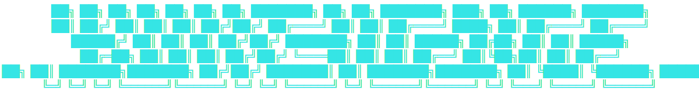
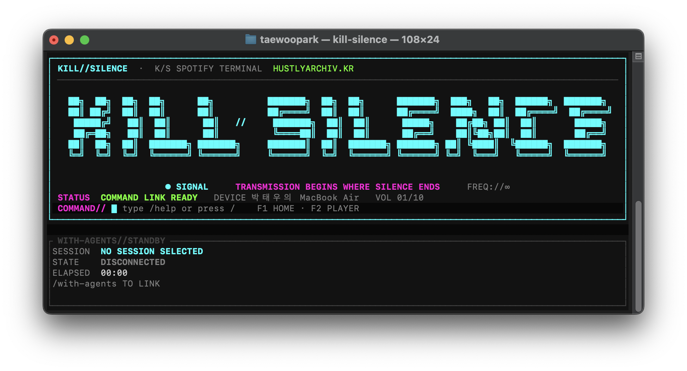
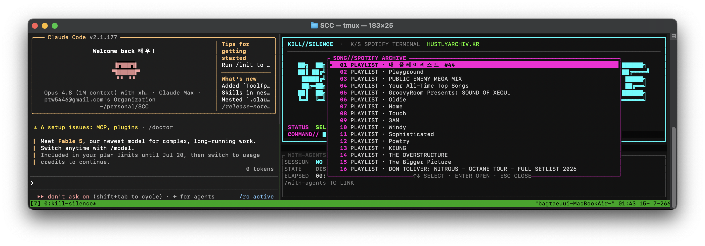
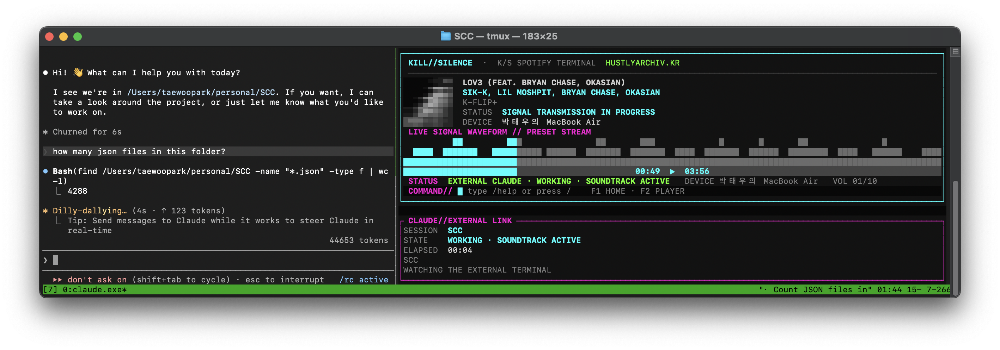
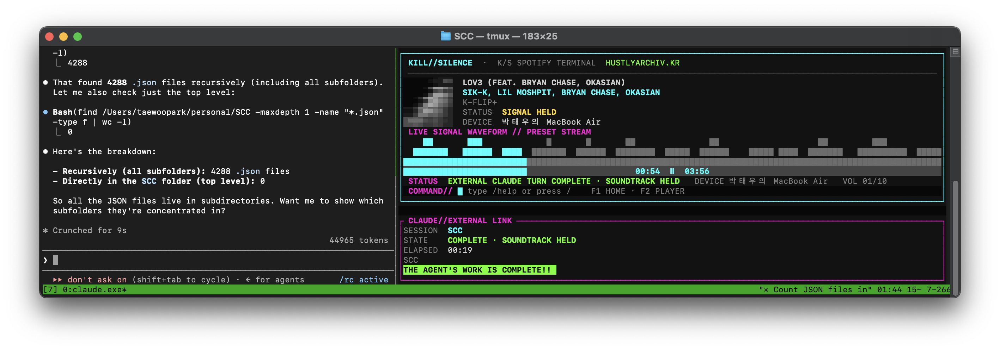
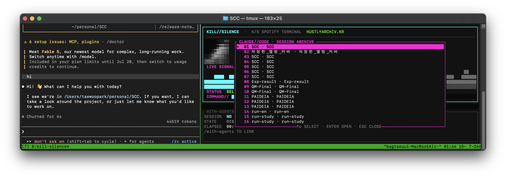
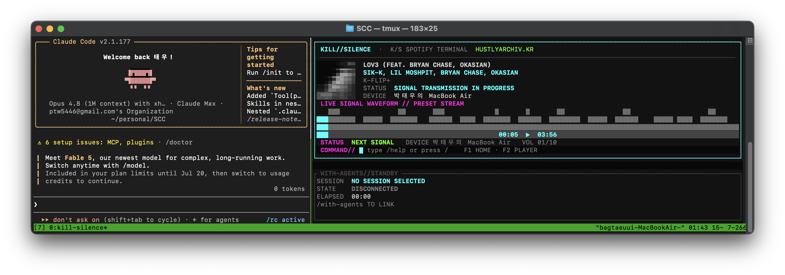
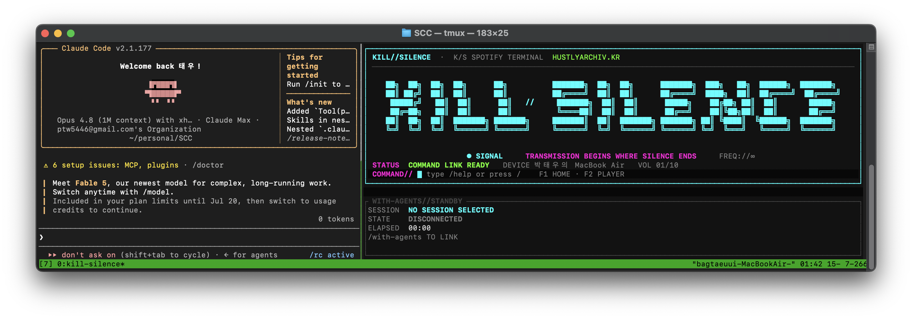

<p align="center">
  
</p>

<p align="center"><strong>에이전트가 내 직업을 대체할까 걱정되나요? 좋습니다. 그동안 에이전트가 코드를 쓰게 두고 우리는 노래나 듣죠.</strong></p>
<p align="center"><em>The agent cooks; you supervise the vibes. ♪</em></p>

<p align="center">
  
  
  
  
</p>

## Why `kill-silence`?

에이전트가 코드를 쓰는 동안 우리는 뭘 하나요? 진지하게 로그를 읽나요? 물론 아닙니다. 프롬프트를 하나 더 딸깍하고, 결과가 나올 때까지 잠깐 멍하니 있다가, 다시 터미널을 전환해 플레이어를 켭니다. 그 전환마저 귀찮습니다.

그래서 **KILL//SILENCE**는 터미널에 늘 떠 있습니다. Spotify를 바로 조작하고, 앨범 커버를 터미널 픽셀로 쪼개고, 그럴듯한 파형을 흘려보냅니다. Claude Code가 실제로 일을 시작하면 음악을 틀고, 끝내면 멈춥니다. 음악이 멈춘 순간에만 우리는 고개를 들면 됩니다. 이건 생산성 도구라기보다, 생산적인 척하기 위한 아주 귀여운 감시등입니다.

<p align="center">
  
</p>

## 30초 설치

준비물은 Rust, Spotify Premium, 그리고 Spotify Desktop 또는 Connect 지원 기기 하나입니다. Claude Code는 `/with-agents`를 쓸 때만 필요합니다.

```bash
git clone https://github.com/TaewoooPark/kill-silence.git
cd kill-silence
cargo install --path spotify_player --locked --force

# 이제 어느 폴더에서든
kill-silence
```

처음 실행하면 브라우저에서 Spotify 승인을 한 번 요청합니다. 승인하고 터미널로 돌아오면 끝입니다. **Spotify username, Client ID, Client Secret, Developer Dashboard, redirect URI를 입력할 필요가 없습니다.**

음악이 안 들리면 Spotify Desktop을 한 번 열어 활성 Connect 기기를 만든 뒤 아래 명령으로 골라주세요.

```text
/spotify device
```

인증을 처음부터 다시 하고 싶을 때만 다음을 실행합니다.

```bash
kill-silence authenticate
```

## 딱 이렇게 쓰면 됩니다

```text
# 1. 음악부터 고른다
/song

# 2. 곡이나 플레이리스트를 Enter로 선택한다
#    이제 에이전트가 일하지 않아도 음악은 그냥 재생된다

# 3. Claude Code도 켜 두었다면 세션을 연결한다
/with-agents

# 4. 실제 Claude turn이 시작되면 음악이 재생되고,
#    끝나면 멈춘다. 우리는 그때만 다시 일한다.
```

커맨드 창에서 `/`만 치면 아래에 인덱스가 뜹니다. `↑` / `↓`로 고르고 `Tab` 또는 `→`로 완성한 뒤 `Enter`를 누르세요. 직접 끝까지 타이핑해도 됩니다. 기계에게 시킬 일과 직접 할 일을 적당히 섞는 것이 핵심입니다.

## 커맨드 사전

| 분류 | 입력 | 하는 일 |
|---|---|---|
| 음악 찾기 | `/song` | 저장한 곡과 플레이리스트를 연다. 선택하면 바로 재생한다. |
|  | `/search <검색어>` | Spotify 전체에서 곡을 검색한다. |
|  | `/queue` | 현재 Spotify 큐를 본다. |
| 재생 | `/play` | 일시 정지된 곡을 이어 재생한다. |
|  | `/stop` | 현재 위치에서 멈춘다. |
|  | `/replay` | 처음으로 돌아가 다시 재생한다. |
|  | `/next` / `/prev` | 다음/이전 곡으로 이동한다. |
|  | `/volume 1..10` | 활성 Spotify 기기의 음량을 조절한다. |
| 보관 | `/like` | 현재 곡을 Spotify 라이브러리에 저장한다. |
| 기기 | `/spotify device` | Spotify Connect 출력 기기를 고른다. |
| 에이전트 | `/with-agents` | 실제 Claude Code 세션을 골라 작업 상태를 지켜본다. |
| 화면 | `/home` | 음악을 끊지 않고 KILL//SILENCE 타이틀 화면으로 간다. |
|  | `/player` | 앨범 커버·파형·진행 바가 있는 플레이어 화면으로 돌아온다. |
| 기타 | `/help` | 커맨드 목록을 연다. |
|  | `/quit` | 예쁘게 터미널을 복구하고 종료한다. |

### 손이 키보드 위에 이미 있다면

| 키 | 하는 일 |
|---|---|
| `F1` | 홈 화면으로 이동. 음악은 계속 간다. |
| `F2` | 플레이어 화면으로 이동. 음악은 계속 간다. |
| `↑` / `↓` | 커맨드 자동완성 또는 목록 선택 |
| `Tab` / `→` | 선택한 커맨드 자동완성 |
| `Enter` | 커맨드 실행 또는 목록 열기 |
| `Esc` | 입력을 비우거나 모달을 닫기 |
| `j` / `k` | 열린 목록에서 위·아래 이동 |
| `Ctrl-C` | 조용히 나가기 |

## `/with-agents`: 음악으로 받는 업무 알림

KILL//SILENCE는 새 AI 채팅창을 만들지도, Claude에게 프롬프트를 대신 넣지도, 대답을 복사해 보여주지도 않습니다. 이미 켜 둔 실제 Claude Code 세션을 읽기 전용으로 지켜볼 뿐입니다.

1. `/with-agents`를 입력하고 세션 하나를 고릅니다.
2. 그 터미널에서 평소처럼 Claude에게 일을 시킵니다.
3. 작업이 시작되면 Spotify가 재생됩니다.
4. 작업이 끝나거나 중단되면 Spotify가 멈추고 완료 신호가 뜹니다.

그러니 왼쪽 터미널에서는 프롬프트를 딸깍하고, 오른쪽 터미널에서는 앨범 커버를 보며 마음의 준비를 하면 됩니다. 세션의 프롬프트와 응답 본문은 렌더링하거나 수정하지 않습니다.

## 현장 기록

| 01 · 곡을 고른다 | 02 · 에이전트는 일을 한다 |
|---|---|
|  |  |

| 03 · 음악이 멈추면 돌아온다 | 04 · 세션을 고른다 |
|---|---|
|  |  |

| 05 · Claude 옆에서 플레이 | 06 · Claude 옆의 홈 |
|---|---|
|  |  |

## 개발 중이라면

```bash
cargo test -p kill-silence
cargo clippy -p kill-silence --all-targets
cargo fmt --all --check
```

설정과 캐시는 각각 `~/.config/kill-silence`, `~/.cache/kill-silence`에 있습니다. 나머지 고급 CLI 옵션은 `kill-silence --help`에서 확인할 수 있습니다.

MIT © 2026 Taewoo Park and spotify-player contributors.
